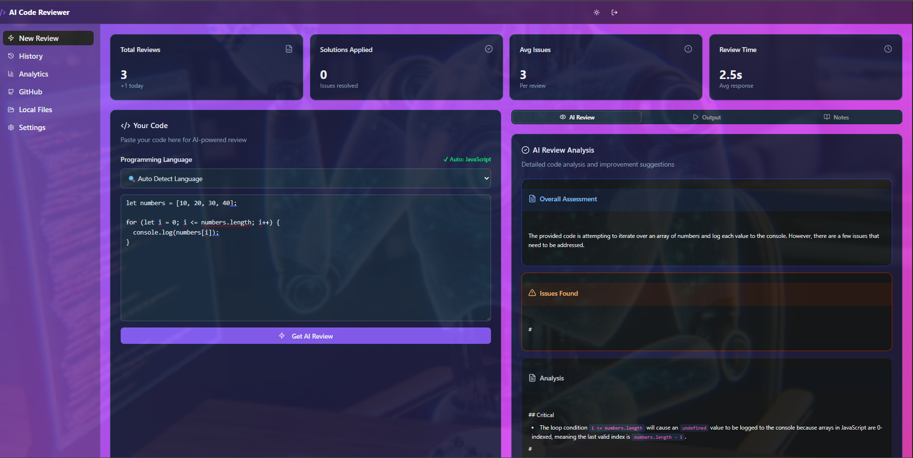
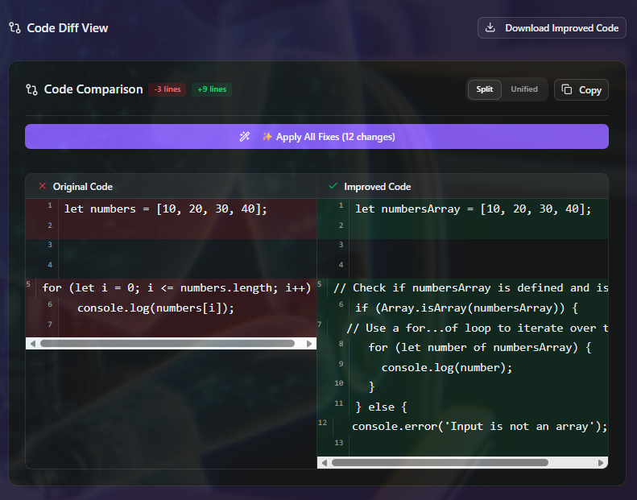
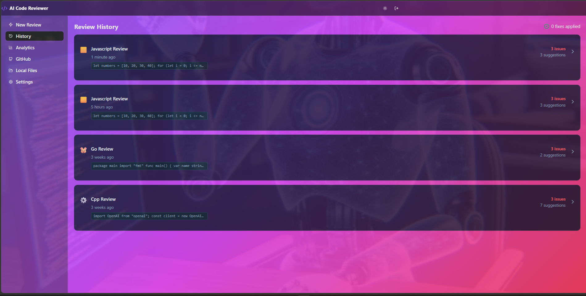
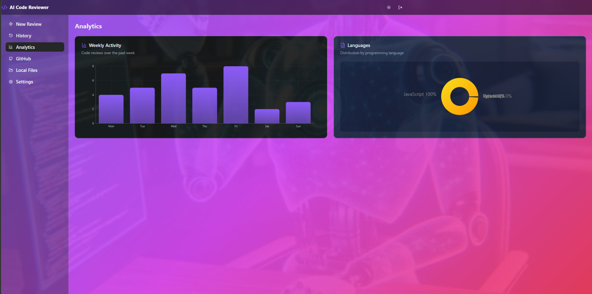
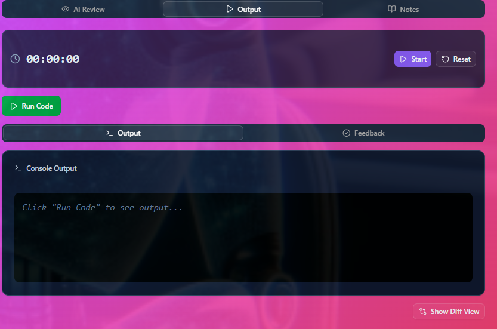
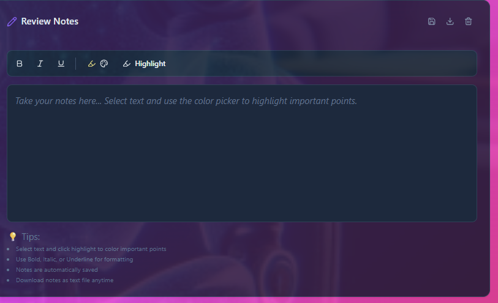
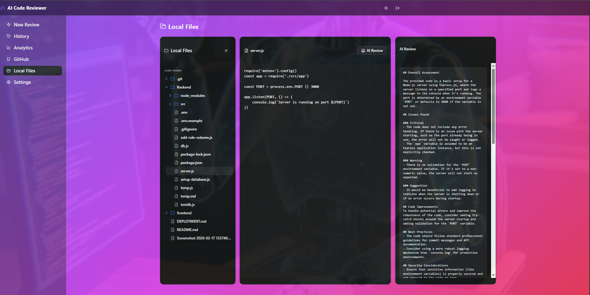
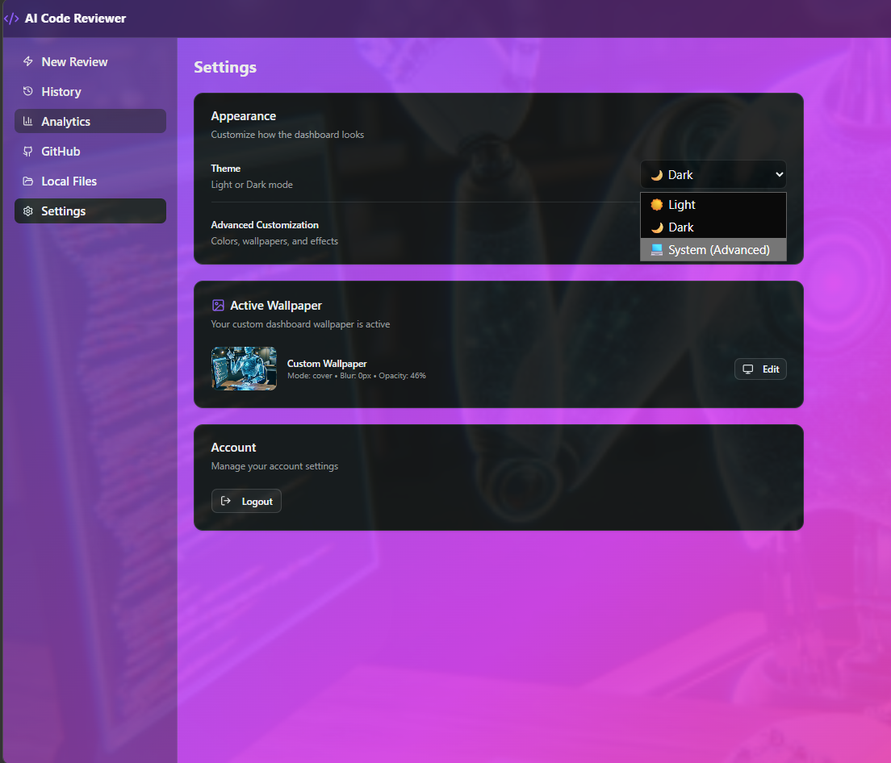
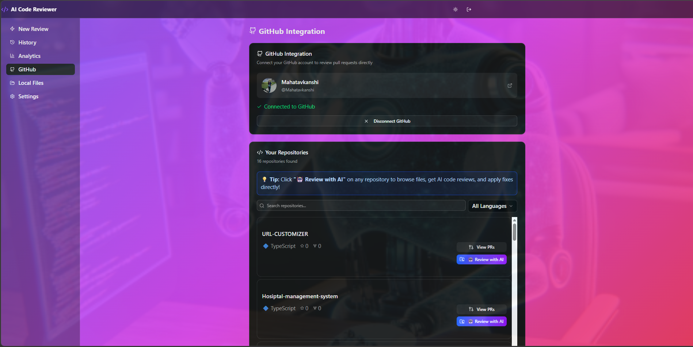

# AI Code Reviewer

An intelligent code review platform powered by AI that helps developers write better code. Features role-based access control with Admin and User dashboards, real-time code analysis, and comprehensive analytics.


## Features

### User Dashboard
- **AI-Powered Code Review** - Get instant feedback on your code with detailed suggestions
- **30+ Language Support** - JavaScript, Python, Java, C++, TypeScript, Go, Rust, and more
- **Auto Language Detection** - Automatically detects programming language
- **Code Diff View** - Side-by-side comparison of original and improved code
- **Download Improved Code** - Export fixed code with proper file extensions
- **Review History** - Track all your past code reviews
- **Analytics Dashboard** - Visualize your coding patterns and improvements
- **Notes Panel** - Add personal notes to each review
- **GitHub Integration** - Import repositories for review
- **Local File Browser** - Review files from your computer

### Admin Dashboard
- **User Management** - View, create, delete users
- **Role Assignment** - Assign admin/user roles
- **Global Review Analytics** - Monitor all reviews across the platform
- **Dashboard Reset** - Clean slate option (preserves admin account)
- **Password Generation** - Auto-generate secure passwords for new users

### Security & Authentication
- JWT-based authentication with role-based access control
- Password visibility toggle for better UX
- Secure password hashing with bcrypt
- Session management

### Customization
- **Theme Support** - Light/Dark mode toggle
- **Accent Color Customization** - Personalize your interface
- **Wallpaper Backgrounds** - Set custom backgrounds with blur effects
- **Gradient Themes** - Beautiful gradient color schemes
- **Large Font Support** - Enhanced readability with 18px base font

## Tech Stack

### Frontend
- React 18 with TypeScript
- Tailwind CSS for styling
- shadcn/ui components
- Recharts for analytics
- Sonner for notifications
- Lucide React for icons

### Backend
- Node.js with Express
- PostgreSQL database
- JWT authentication
- bcrypt password hashing
- CORS enabled

### AI Integration
- Google Gemini AI for code analysis
- Intelligent language detection
- Smart code improvement suggestions

## Installation

### Prerequisites
- Node.js 18+
- PostgreSQL 14+
- Google Gemini API key

### Setup

1. **Clone the repository**
   ```bash
   git clone https://github.com/yourusername/AI-code-Reviewer.git
   cd AI-code-Reviewer
   ```

2. **Backend Setup**
   ```bash
   cd Backend
   npm install
   ```
   
   Create a `.env` file:
   ```env
   PORT=5000
   DB_HOST=localhost
   DB_PORT=5432
   DB_NAME=ai_code_reviewer
   DB_USER=your_db_user
   DB_PASSWORD=your_db_password
   JWT_SECRET=your_jwt_secret_key
   GEMINI_API_KEY=your_gemini_api_key
   ```
   
   Run database migrations:
   ```bash
   node add-role-column.js
   ```
   
   Start the server:
   ```bash
   npm start
   ```

3. **Frontend Setup**
   ```bash
   cd ../frontend
   npm install
   npm run dev
   ```

4. **Access the application**
   - User login: http://localhost:5173
   - Backend API: http://localhost:5000

## Default Admin Credentials

- **Email**: `22040690@coer.ac.in`
- **Password**: `sajal`

Admins can create new users and manage the platform from the `/admin` dashboard.

## Usage

### For Users
1. Sign up or log in to your account
2. Navigate to the Review tab
3. Paste your code in the editor
4. Select language (or use auto-detect)
5. Click "Get AI Review"
6. View suggestions and download improved code
7. Check your review history and analytics

### For Admins
1. Log in with admin credentials
2. Access the Admin Dashboard at `/admin`
3. View statistics: Total Users, Total Reviews, Today's Reviews
4. Manage users: Add, delete, change roles
5. View all reviews across the platform
6. Reset dashboard if needed

## Environment Variables

### Backend (.env)
```env
PORT=5000
DB_HOST=localhost
DB_PORT=5432
DB_NAME=ai_code_reviewer
DB_USER=postgres
DB_PASSWORD=your_password
JWT_SECRET=your_super_secret_jwt_key
GEMINI_API_KEY=your_gemini_api_key
```

### Frontend
No environment variables required for basic setup.

## Database Schema

### Users Table
- id (PRIMARY KEY)
- username
- email
- password_hash
- role (user/admin)
- created_at

### Code Reviews Table
- id (PRIMARY KEY)
- user_id (FOREIGN KEY)
- code_snippet
- language
- ai_review
- improved_code
- issues_count
- suggestions_count
- fix_applied
- created_at

## API Endpoints

### Authentication
- `POST /api/auth/register` - Register new user
- `POST /api/auth/login` - User login

### Reviews
- `POST /api/reviews` - Create new review
- `GET /api/reviews/history` - Get user review history
- `GET /api/reviews/stats` - Get user statistics
- `GET /api/reviews/:id` - Get specific review

### Admin (Protected)
- `GET /admin/users` - Get all users
- `POST /admin/users` - Create new user
- `DELETE /admin/users/:id` - Delete user
- `PATCH /admin/users/:id/role` - Change user role
- `GET /admin/stats` - Get platform statistics
- `GET /admin/reviews` - Get all reviews
- `POST /admin/reset` - Reset dashboard

## Screenshots

<table>
  <tr>
    <td align="center">
      <strong>Dashboard</strong><br/>
      
    </td>
    <td align="center">
      <strong>Code Comparison</strong><br/>
      
    </td>
  </tr>
  <tr>
    <td align="center">
      <strong>Review History</strong><br/>
      
    </td>
    <td align="center">
      <strong>Analytics</strong><br/>
      
    </td>
  </tr>
  <tr>
    <td align="center">
      <strong>Output</strong><br/>
      
    </td>
    <td align="center">
      <strong>Notes</strong><br/>
      
    </td>
  </tr>
  <tr>
    <td align="center">
      <strong>Local Files</strong><br/>
      
    </td>
    <td align="center">
      <strong>Theme Settings</strong><br/>
      
    </td>
  </tr>
  <tr>
    <td align="center" colspan="2">
      <strong>GitHub Integration</strong><br/>
      
    </td>
  </tr>
</table>

## Contributing

1. Fork the repository
2. Create your feature branch (`git checkout -b feature/AmazingFeature`)
3. Commit your changes (`git commit -m 'Add some AmazingFeature'`)
4. Push to the branch (`git push origin feature/AmazingFeature`)
5. Open a Pull Request

## License

This project is licensed under the MIT License.

## Acknowledgments

- Google Gemini AI for code analysis
- shadcn/ui for beautiful components
- Tailwind CSS for styling
- PostgreSQL for reliable data storage

## Support

For support, email your-email@example.com or open an issue in the repository.

---

Made with ❤️ by [Your Name](https://github.com/yourusername)
